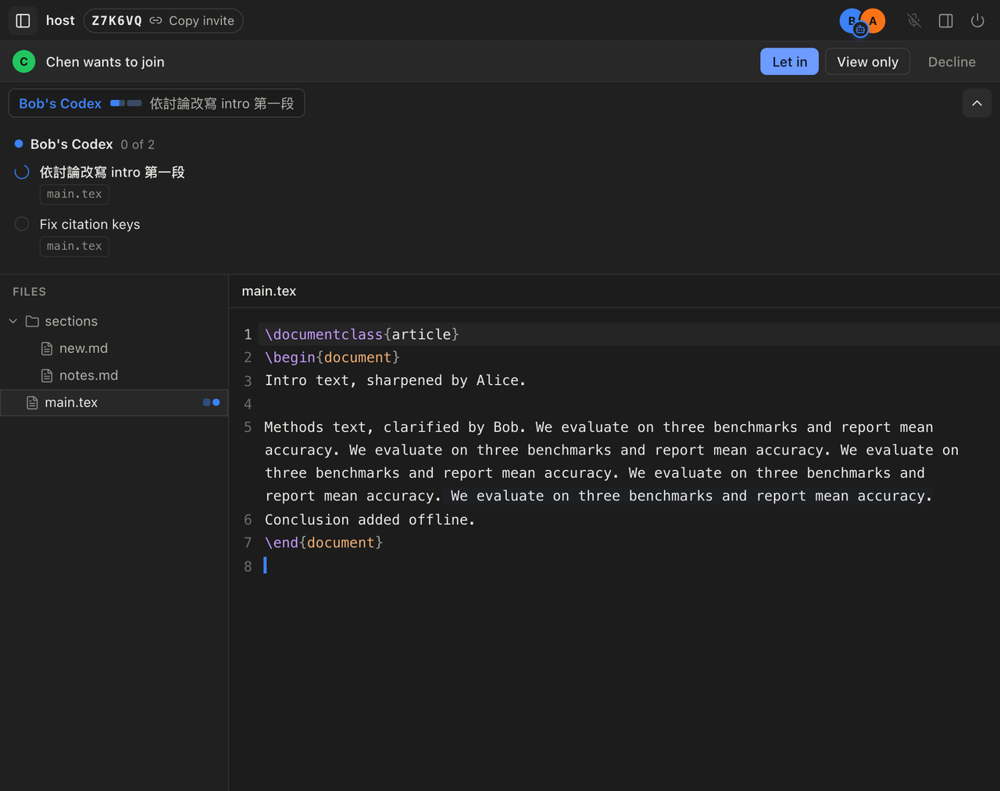

# Codex Live Share

Live Share for the Codex desktop app. Share the folder a Codex session is working in, and three things happen:

- People edit it together in Codex's side browser, with live cursors.
- Every person's Codex can work on it too. Before an agent changes anything, it posts a short plan that everyone sees, labelled with whose agent it is.
- What people say aloud is transcribed, so you can tell your agent "apply what we just discussed" and it knows what that was.

The first use case is co-writing a Markdown or LaTeX paper. Live Share is a Codex plugin; this repository is also its plugin marketplace.



## Features

- **The whole folder, live.**
  - Text files merge character by character (Yjs CRDT), so an agent's patch and a person's typing in the same file both survive.
  - Images and other binary files sync as whole files.
  - `.git`, `node_modules`, `.env*`, anything in `.gitignore`, and TeX build output are never shared.
- **Agents as participants.**
  - An agent publishes a 1–5 item plan before it edits, and checks items off as it goes.
  - A Codex `PreToolUse` hook blocks file edits until a plan exists, and a `Stop` hook reminds the agent to close the plan.
  - Each chat has its own plan. Hooks check shared plans locally, pause a patch once for a new overlapping scope, and deliver agent messages without routine status polling.
  - Text an agent just wrote glows in its owner's color in everyone's editor, then fades.
- **A transcript agents can read.**
  - Each person transcribes only their own microphone, so every line is attributed to its speaker.
  - It uses OpenAI or Gemini realtime transcription with your own API key. The key never leaves your computer.
- **Built for a narrow side pane.**
  - File tree, CodeMirror editor with remote cursors, agent plan rail, and transcript panel.
  - Knock-to-join admission, with edit or view-only access.
  - English and Traditional Chinese, following your browser.

## Install

In the Codex app, open **Plugins**, add the marketplace `JacobLinCool/codex-live-share`, and install **Live Share**. Or from a terminal:

```sh
codex plugin marketplace add JacobLinCool/codex-live-share
codex plugin add live-share@codex-live-share
```

Restart Codex afterwards.

- The plugin checks available Node.js runtimes before starting, including loading its bundled WebRTC addon. It prefers a compatible Codex runtime, then Node.js on `PATH`. If none passes, install Node.js 22 or newer. Set `CODEX_LIVE_SHARE_NODE` to an executable to select it explicitly; an incompatible explicit choice fails with its startup error.
- It carries WebRTC binaries for macOS (Apple silicon), Linux (x64 and arm64, glibc and musl), and Windows (x64 and arm64).
- The first time you share in direct mode, it downloads Cloudflare's `cloudflared` (about 20–40 MB) and verifies its checksum before running it.

## How to use it

**Start (host)**
1. In the Codex session for your project folder, say **"Start live share"**.
2. Your agent opens the editor in the side browser and gives you an invite link like `https://some-words.trycloudflare.com/j/K7QF2M`.
3. The first time, the editor asks you to confirm the name others will see.

**Join (guest)**
1. Open the invite link and follow its steps: install the plugin, then open a **new, empty folder** in Codex.
2. Tell your agent **"Join live share https://some-words.trycloudflare.com/j/K7QF2M"**.
3. The host sees a knock in their editor and chooses **Let in**, **View only**, or **Decline**.
4. Once you're in, the shared files are copied into your folder and kept in sync.

**Work together**
- Edit in the side browser. Everyone sees each other's cursors and which file each person has open.
- Press the microphone to transcribe your voice. The first time, it asks for an OpenAI or Gemini API key.
- Ask your agent, for example, *"照剛剛討論的改 intro"* or *"apply what we just discussed to the abstract"*. It reads the transcript, posts its plan, edits, and checks items off. Everyone can follow along.
- Agents can coordinate with `agent_message`, addressed to another agent's plan. Messages are visible to participants and delivered at the recipient's next tool hook or turn boundary; idle agents are not woken. Undelivered messages expire after 15 minutes.

**Finish**
- Say "End live share", or press the power button in the editor.
- For the host this ends the session for everyone. Everyone keeps their copy of the files.
- The transcript is saved to `~/.codex-live-share/shares/<id>/transcript.md`.

## Connection modes

| | **Direct** (default) | **Hosted** |
| --- | --- | --- |
| Signaling | The host runs the room on their own machine, published through a free, anonymous Cloudflare quick tunnel (`*.trycloudflare.com`). | A Cloudflare Worker and Durable Object (`apps/signal`). |
| Central service in the path | None. | Signaling only. |
| Strict NAT / corporate networks | May fail (STUN only). | Works: Cloudflare TURN relays the encrypted traffic. |
| Invite | `https://<words>.trycloudflare.com/j/CODE` | `https://<worker>/j/CODE`, or just the code |

To use hosted mode, ask your agent to "start live share in hosted mode", or set `CODEX_LIVE_SHARE_MODE=hosted`.

What a quick tunnel's changing address means in direct mode:
- **If only `cloudflared` restarts**, the host sends the new address to connected guests automatically.
- **If the host's Live Share service restarts**, guests need the new invite link. Joining again from the same folder resumes their copy.

### Hosted mode sign-in

Only the **host** of a hosted room signs in; guests never need an account.

Say "sign in to live share", or call `live_share_login`. Your agent shows a short code: open `github.com/login/device`, enter the code, and approve. Call `live_share_account` to confirm the sign-in.

## Privacy and security

- **Data path.** Files, plans, agent messages, edits and the transcript travel only between participants, over encrypted WebRTC data channels. Neither the tunnel nor the Worker carries them; TURN relays only ciphertext.
- **Admission.** Joining needs the invite link and the host's approval. Each peer proves its identity on reconnect with a per-share secret.
- **Local access.** The editor and the agent tools talk to a service bound to `127.0.0.1` and protected by a per-share token. Only the signaling endpoint is exposed through the tunnel.
- **Hosted-mode tokens.** The service stores only hashes of hosted-mode tokens. The GitHub token used to sign in is exchanged once, then discarded.
- **API keys.** Transcription keys are stored only in `~/.codex-live-share/config.json` (mode 0600). The browser receives short-lived tokens.
- **View-only access.** View-only participants cannot change shared files; local edits to them are reverted.

## Architecture

```
Codex ── MCP (stdio) + hooks ──► Live Share daemon (one per shared folder, on Codex's Node)
                                   │  folder ⇄ Y.Doc bridge · local HTTP/WS for the editor · RPC
side browser (apps/web) ──WS────┘  │
                                   ├── WebRTC data channels ◄──► other participants' daemons
                                   └── signaling: own room + quick tunnel (direct) │ Worker (hosted)
```

| Path | Role |
| --- | --- |
| `packages/protocol` | Shared types: Y.Doc layout (files, blobs, plans, transcript, edits), plan rules, signaling and local frames. |
| `packages/sync` | `FolderSync`: three-way merges disk edits into `Y.Text` and writes remote changes back atomically. One idempotent step per path, so concurrent agent edits are merged rather than overwritten. |
| `packages/signal-core` | `RoomCore`: knock, admit, deny, relay, reconnection. Also the invite landing page. It runs in both the Worker and the host's daemon. |
| `packages/transcribe` | Browser live transcription (Gemini / OpenAI), vendored from Weave-In. |
| `apps/daemon` | The CLI behind the plugin. It contains the daemon (node-datachannel mesh, doc hub, persistence, direct-mode room and tunnel), the stdio MCP server, and the hook handler. |
| `apps/web` | The editor UI: CodeMirror 6 with y-codemirror.next, plan rail, transcript, admission and setup banners. |
| `apps/signal` | Hosted mode's Cloudflare Worker. Durable Objects hold rooms (`Room`) and accounts (`Account`: GitHub identity, hashed tokens, room ownership). It also issues TURN credentials and applies rate limits. |
| `plugin-src` | Plugin manifest, skill, hooks, `.mcp.json`, launchers (`bin/run`, `bin/run.cmd`) and assets. |
| `plugins/live-share` | The built plugin. **Generated and committed**: `.agents/plugins/marketplace.json` points here. |

Per-folder state (room, peer secret, Y.Doc history) lives in `~/.codex-live-share/shares/`, so a restarted daemon resumes the same room without duplicating text.

## Development

Requires Node.js 22+ and pnpm.

```sh
pnpm install
pnpm check          # typecheck, all tests, and a full build including plugins/live-share
pnpm build:plugin   # reassemble plugins/live-share from the existing builds
```

**Try the plugin from a checkout.**
- Run `codex plugin marketplace add "$PWD"`, then `codex plugin add live-share@codex-live-share`, and restart Codex.
- After a change, run `pnpm build`, bump `version` in the root `package.json`, and run `codex plugin marketplace upgrade`.

**Run a share without Codex.**

```sh
plugins/live-share/bin/run start ./paper            # prints the invite link and editor URL
plugins/live-share/bin/run join <invite> ./empty    # in another CODEX_LIVE_SHARE_HOME
plugins/live-share/bin/run admit Bob ./paper
plugins/live-share/bin/run status ./paper
plugins/live-share/bin/run end ./paper
```

Give each simulated person their own `CODEX_LIVE_SHARE_HOME` to run several "people" on one machine.

**Hosted mode, locally.**
1. Copy `apps/signal/.dev.vars.example` to `apps/signal/.dev.vars`. It turns on development sign-in and sets an admin token; `DEV_SESSION_MS` can shorten time-limited sessions so you can test the cutoff.
2. Run `pnpm dev:signal`.
3. With `CODEX_LIVE_SHARE_SIGNAL_URL=http://127.0.0.1:8787` set:
   - sign in without GitHub using `bin/run login --dev alice`;
   - start with `bin/run start ./paper --hosted`.

Development sign-in only works when `DEV_AUTH=allow` and the request comes from localhost. Never set it in production.

**Deploying hosted mode.**
1. Create a GitHub App (an OAuth app also works):
   - callback URL `https://<worker>/auth/github/callback`;
   - **Enable Device Flow** checked, webhook off, no permissions.

   Put its client ID in `GITHUB_CLIENT_ID` in `apps/signal/wrangler.jsonc`, and generate a client secret for `wrangler secret put GITHUB_CLIENT_SECRET`. The plugin's device flow needs only the client ID; the secret is used for website sign-in.
2. Set an admin token: `wrangler secret put ADMIN_TOKEN`.
3. Optionally, for the relay, set Cloudflare TURN keys: `wrangler secret put TURN_KEY_ID` and `wrangler secret put TURN_KEY_SECRET`.
4. Run `pnpm --filter @codex-live-share/signal deploy`.
5. Point `DEFAULT_HOSTED_SIGNAL_URL` in `apps/daemon/src/config.ts` at the Worker URL, then rebuild the plugin.

Secrets set with `wrangler secret put` are kept across deploys.

**Continuous integration and deployment.**
- `.github/workflows/ci.yml` runs `pnpm check` on every push and pull request. It fails if the committed `plugins/live-share` does not match a fresh build.
- `.github/workflows/deploy-signal.yml` deploys the Worker when a push to `main` changes it or the packages it is built from. It runs the tests first, and can also be run by hand.
- It needs one secret in the repository's `production` environment: `CLOUDFLARE_API_TOKEN`, from the "Edit Cloudflare Workers" template. The account is set by `account_id` in `wrangler.jsonc`.

## Known limitations

- **Platforms.** Only macOS on Apple silicon has been tested end to end. Linux and Windows binaries are included but untested; on Windows, Codex must be able to launch the plugin's MCP server.
- **Direct mode behind strict NAT.** Peers behind symmetric NAT cannot connect in direct mode; use hosted mode.
- **Ignore rules.** Only the top-level `.gitignore` is honored.
- **Edit enforcement.** The plan-before-edit hook covers Codex's `apply_patch` edits, not files changed through shell commands.
- **Concurrent edits.** Overlap checks use declared file paths and locally received plans, not distributed locks. A new overlap pauses a patch once for review; a retry proceeds. Simultaneous offline edits and semantic conflicts still require coordination. Shell hooks deliver messages but do not infer which files an arbitrary command will modify.
- **Microphone in Codex's side browser.** If the side browser blocks the microphone, open the editor URL in a regular browser to transcribe.

## License

MIT
